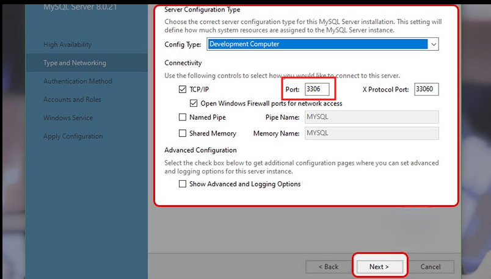
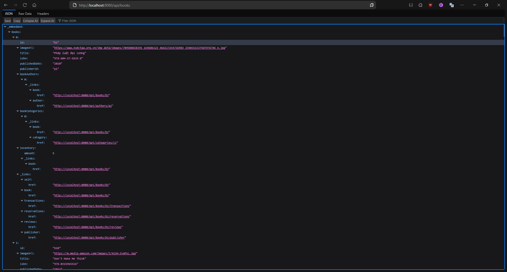

<p align="center">
  <a href="https://www.uit.edu.vn/" title="Trường Đại học Công nghệ Thông tin" style="border: none;">
    
  </a>
</p>


## GIỚI THIỆU ĐỒ ÁN

-    **Đề tài:** Xây dựng hệ thống quản lý thư viện

## CÔNG NGHỆ SỬ DỤNG

-    **Backend:** [Java](https://www.java.com/en/), [Spring Boot](https://docs.spring.io/spring-boot/docs/current/reference/htmlsingle/)
-    **Frontend:** [Nextjs](https://nextjs.org/)
-    **Database:** [MySQL](https://www.mysql.com/)

## THÀNH VIÊN NHÓM

| STT | MSSV     | Họ và Tên            | GitHub                            | Email                  |
| :-- | :------- | :------------------- | :-------------------------------- | :--------------------- |
| 1   | 23520906 | Hứa Văn Lý           | https://github.com/LyyHua         | 23520906@gm.uit.edu.vn |
| 2   | 23520917 | Trần Quang Mạnh      | https://github.com/manhtq0508     | 23520917@gm.uit.edu.vn |
| 3   | 23520922 | Hà Nhật Minh         | https://github.com/Pockii9        | 23520922@gm.uit.edu.vn |
| 4   | 23520923 | Hồ Nguyên Minh       | https://github.com/honguyenminh   | 23520923@gm.uit.edu.vn |

# SETUP TRƯỚC KHI KHỞI ĐỘNG PROJECT

## 1. Cài đặt MySQL Community

- Trước khi bắt đầu cần cài đặt MySQL và cấu hình MySQL trên máy tính của bạn. Phiên bản sử dụng là [MySQL Community](https://dev.mysql.com/downloads/installer/)

> [!NOTE]
> - Khi cấu hình port của MySQL nếu có thay đổi cần nhớ port này vì nó sẽ được sử dụng trong file cấu hình của Spring Boot (mặc định là port 3306)
> 
> 

- Sau khi cài đặt, mở SQL Workbench, login vào MySQL với tài khoản root và mật khẩu đã cấu hình trong quá trình cài đặt.
- Tiếp theo tiến hành mở file `src\main\java\com\todo\backend\sql\InitSampleData.sql` và chạy để khởi tạo database mẫu

## 2. Cấu hình file `application.properties`

- Mở file `src\main\resources\application.properties` và cấu hình port, database, username, password cho MySQL (tập trung chủ yếu trong 3 dòng đầu tiên):

```properties
spring.datasource.url=jdbc:mysql://localhost:<port>/<database_name>?useUnicode=true&characterEncoding=UTF-8&allowPublicKeyRetrieval=true&useSSL=false&serverTimezone=UTC
spring.datasource.username=<your_mysql_username>
spring.datasource.password=<your_mysql_password>

# Nội dung còn lại file application.properties
```

- Trong đó:
  - `<port>`: là port mà bạn đã cấu hình trong MySQL
  - `<database_name>`: là tên database mà bạn đã tạo trong MySQL
  - `<your_mysql_username>`: là username mà bạn đã cấu hình trong MySQL
  - `<your_mysql_password>`: là password mà bạn đã cấu hình trong MySQL

- Ví dụ: nếu bạn chạy file `InitSampleData.sql` (Khởi tạo database `nextjslibrarydatabase`) trong bước 1 và cấu hình port là `3306`, username là `demo` và password là `demo@123` thì file `application.properties` sẽ có nội dung như sau:

```properties
spring.datasource.url=jdbc:mysql://localhost:3306/nextjslibrarydatabase?useUnicode=true&characterEncoding=UTF-8&allowPublicKeyRetrieval=true&useSSL=false&serverTimezone=UTC
spring.datasource.username=demo
spring.datasource.password=demo@123

# Nội dung còn lại file application.properties
```

> [!CAUTION]
> - Hãy chắc chắn rằng bạn đã tạo database trong MySQL trước khi chạy project. Nếu không, bạn sẽ gặp lỗi khi chạy project.
> - Cẩn thận khi commit file `application.properties` lên git vì nó chứa thông tin nhạy cảm như username và password của MySQL. Bạn có thể sử dụng file `.gitignore` để bỏ qua file này.

## 3. Chạy project

- Sau khi đã thực hiện đầy dủ 2 bước trên, bạn có thể chạy project và kiểm tra các api đã được xây dựng trong project.
- Để chạy project, bạn có thể sử dụng IDE như IntelliJ IDEA hoặc Eclipse. Nếu bạn sử dụng IntelliJ IDEA, bạn có thể nhấn vào nút Run trên thanh công cụ hoặc sử dụng phím tắt `Shift + F10` để chạy project.
- Bạn cũng có thể sử dụng lệnh sau để chạy project từ command line:

```powershell
cd backend
.\mvnw.cmd spring-boot:run
```

> [!NOTE]
> - Hãy để ý logging trong terminal, nếu có lỗi xảy ra trong quá trình chạy project, bạn sẽ thấy thông báo lỗi trong terminal. Nếu không có lỗi xảy ra, bạn sẽ thấy thông báo `Started BackendApplication in ... seconds` và các thông tin khác liên quan đến việc khởi động project.

## 4. Kiểm tra API

- Sau khi chạy project thành công, bạn có thể kiểm tra các API đã được xây dựng trong project bằng cách sử dụng Postman hoặc bất kỳ công cụ nào khác hỗ trợ gửi request HTTP (web browser, postman, ...).

```link
http://localhost:8080/api
```

- Nhấp vào api bất kỳ (ví dụ books) và nếu có dữ liệu trả về thì có nghĩa là bạn đã cấu hình thành công project.


